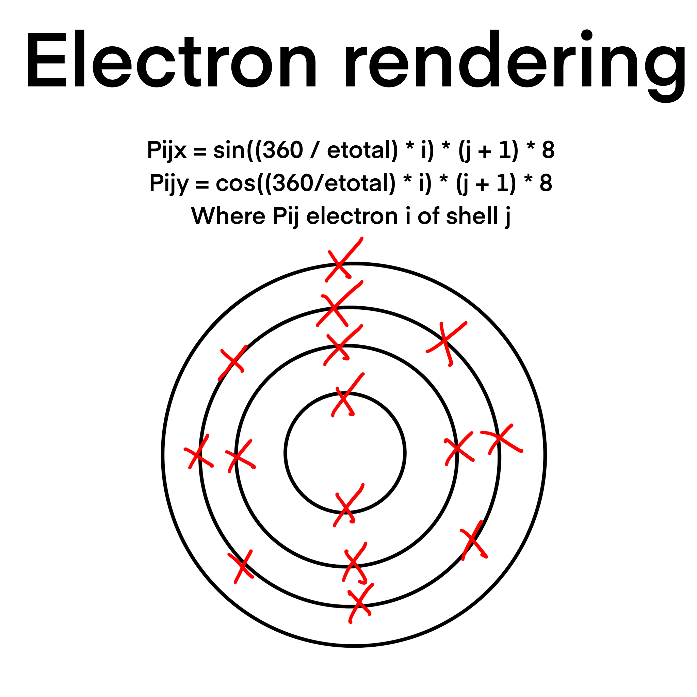
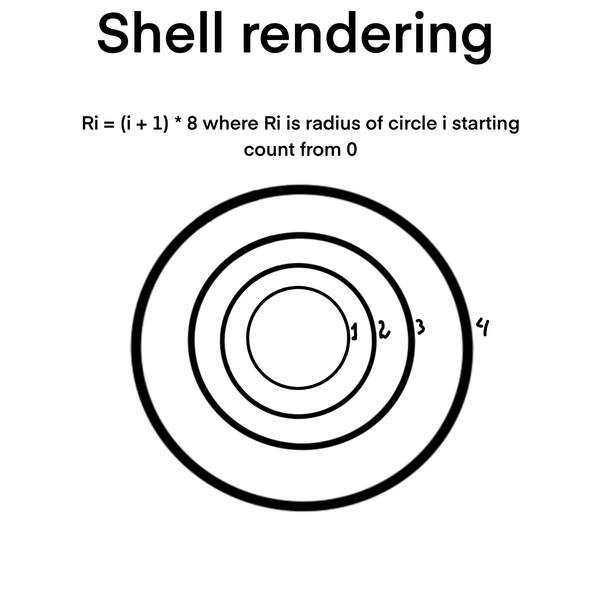
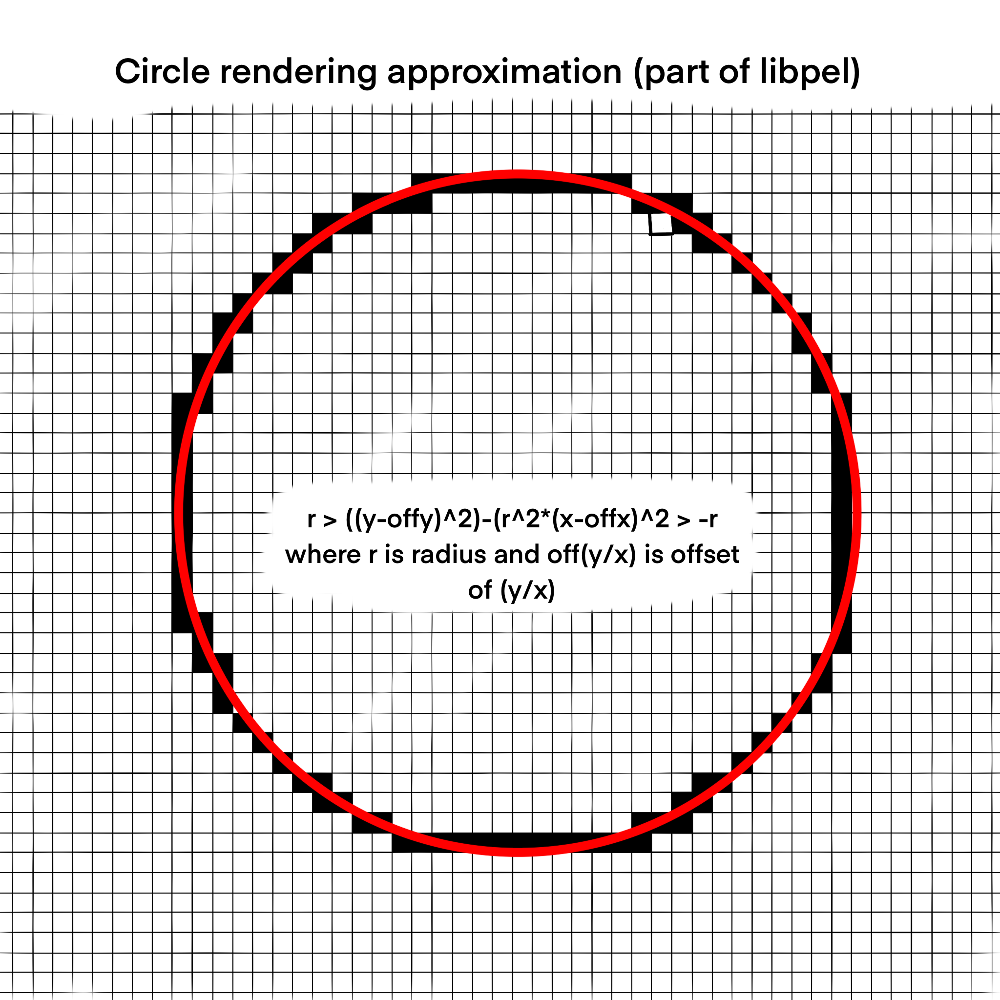

# elconf
School project. CLI program that creates a png file representing an element's electronic configuration.

This program uses the following libraries made by me: [libpttui](https://github.com/TheAlexDev23/libpttui), [libperiodic-c](https://github.com/TheAlexDev23/libperiodic-c) and [libpel](https://github.com/TheAlexDev23/libpel)

This program uses the following open source libraries: [cwalk](https://github.com/likle/cwalk), [png](http://www.libpng.org/pub/png/libpng.html)

This program and all the libraries it uses made by me are licensed under GPL3

## How it works
<div>



</div>

## Building
Building requires the following dependencies: cwalk, png, [libpel](https://github.com/thealexdev23/libpel)(install instructions in the repository)
```bash
git clone https://github.com/TheAlexDev23/elconf.git
cd elconf
cmake -B build
cd build
make
```

## Running
To run the program, provide the root directory of the project and additionaly the file. If not provided will save under output.png. Assuming in build folder:
```bash
./elconf .. file.png
```


 
